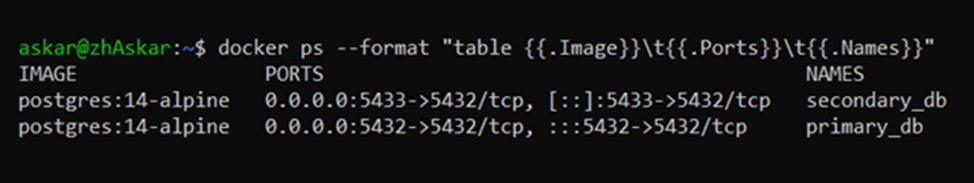
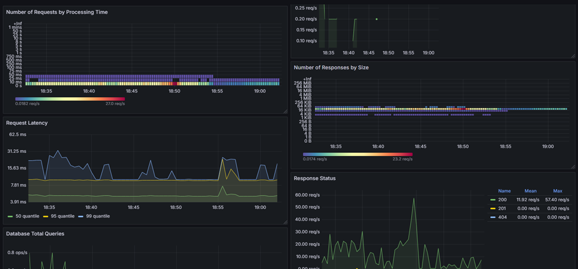
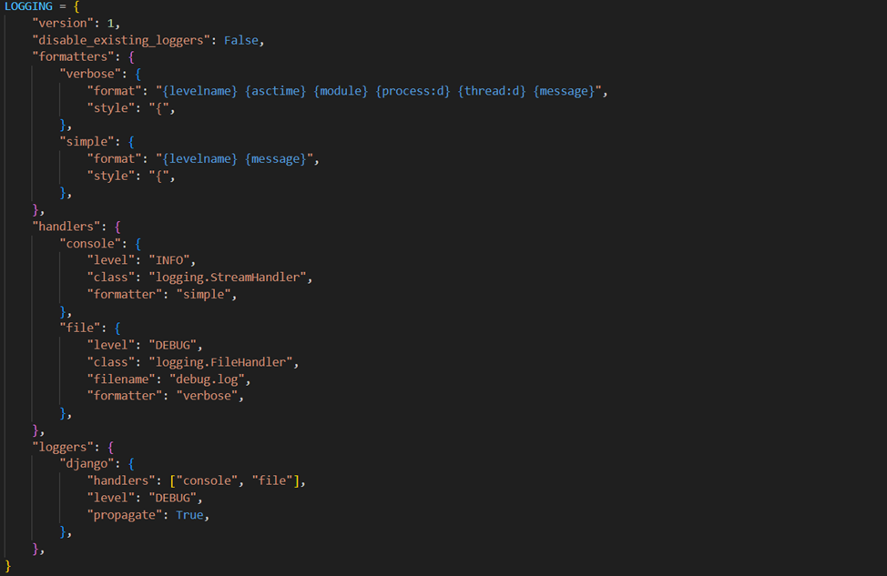
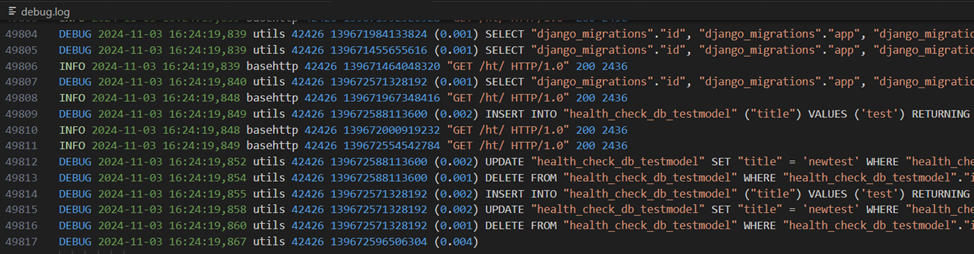
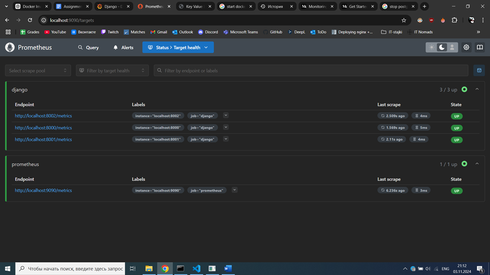
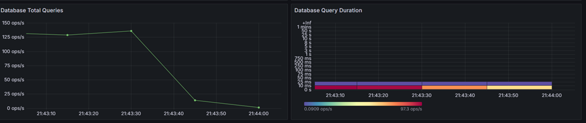

# Project Overview

This project demonstrates a scalable, robust backend system using Django, Gunicorn, Nginx, PostgreSQL, and monitoring tools such as Prometheus and Grafana. The aim is to address the challenges associated with high-load distributed environments, ensuring data consistency, system scalability, and effective observability.

## Features Implemented

- **Django API**: Developed a simple API using Django’s generics views and model serializers to streamline backend functionalities.
- **Multiple Gunicorn Instances**: Configured three separate Gunicorn services to handle concurrent requests efficiently.
- **Nginx Load Balancing**: Used Nginx as a load balancer to distribute incoming traffic across Gunicorn instances for better system reliability and responsiveness.
- **Database Scaling**: Set up a primary PostgreSQL database with a read replica to offload read-heavy operations, enhancing overall query response times.
  
- **Monitoring and Observability**: Integrated Prometheus and Grafana for real-time monitoring and visualization of key metrics, such as response times and error rates.
  
  Also added built-in logging from Django.
  
  

## Monitoring Tools

- **Prometheus**: Collected metrics related to requests, database queries, and response times
  
- **Grafana**: Visualized metrics to quickly identify and respond to issues
  

## Conclusion

This project highlights the effective use of scalable backend architectures to handle high-load environments, ensuring strong data consistency and observability. The combination of load balancing, database scaling, and detailed monitoring creates a resilient system capable of handling growth and complexity.
